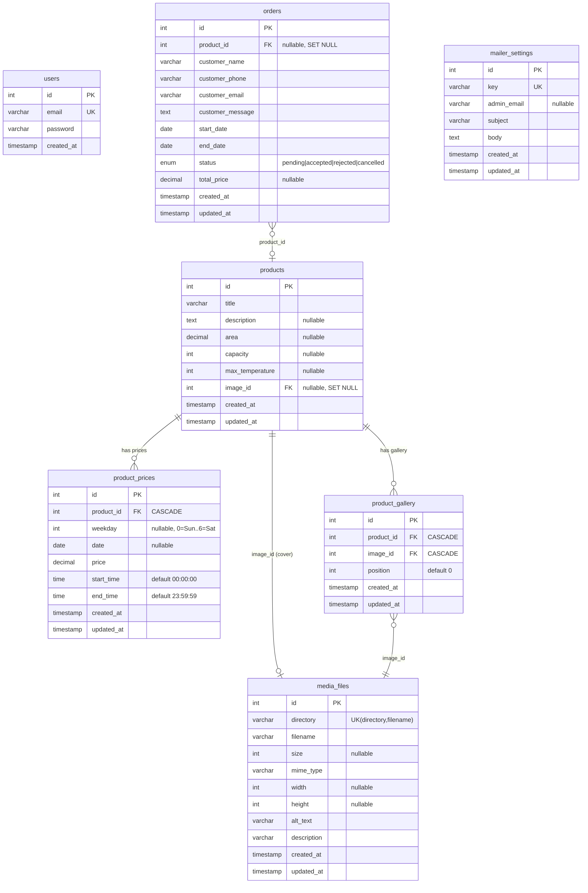

# Eco Sauna Admin — Project Documentation

> Admin panel for managing products (saunas / rental objects), bookings
> (orders), media files, and email-notification templates.

## 1. Overview

Monorepo with two parts orchestrated via Docker Compose:

| Part       | Stack                                                       | Port (dev) |
|------------|-------------------------------------------------------------|------------|
| `backend`  | NestJS 11, TypeORM 0.3, PostgreSQL, JWT (passport-jwt)       | 3000       |
| `frontend` | Vue 3 (Composition API), Pinia, Vue Router, naive-ui, Quill | 5173       |
| PostgreSQL | database                                                    | 5432       |
| pgAdmin    | DB admin UI                                                 | 8020       |
| MailHog    | local SMTP for inspecting emails (dev)                      | 8025       |

**Prod:** the frontend is built into static assets and served by nginx
([frontend/nginx.conf](../frontend/nginx.conf)), which proxies `/api/` and
`/uploads/` to the backend container. Uploaded files live on the host under
`./backend/uploads/` (bind-mount, survives rebuilds).

### Key backend modules

- **auth** — login, initial user creation, token check.
- **user** — user access (read-only `me`).
- **token** — JWT issue/verify (global module, `expiresIn: 8h`).
- **products** — product CRUD together with prices and gallery.
- **media** — upload/edit/delete media files (multer, disk storage).
- **orders** — booking CRUD + automatic price calculation + email notifications.
- **settings** — email templates (`mailer_settings`).

### Authentication

- No roles — there is exactly one user type (admin), created by the seed
  ([backend/src/seed.ts](../backend/src/seed.ts)) or via
  `POST /api/auth/register-initial`.
- A JWT is issued on login (`access_token`), valid for 8 hours.
- Route protection is a small custom
  [JwtAuthGuard](../backend/src/guards/jwt.guard.ts): it reads
  `Authorization: Bearer <token>` and verifies signature/expiry. **The payload
  is not attached to the request** — protected handlers get no user from the
  guard (the exception is `UserController.getMe`, which decodes the token
  manually).
- ⚠️ The secret defaults to `bad_secret_key` when `JWT_SECRET` is not set.

## 2. Data Model

Every table has `created_at`; most also have `updated_at` (except `users`).
Primary keys are auto-increment `int`.

### ER diagram



### Entity notes

**products** — the core entity (a sauna / rental object). It has:
- one cover `image` (media_files, `SET NULL` when the file is deleted);
- many `prices` — flexible pricing;
- many `gallery` items — an ordered set of images (`position`).

**product_prices** — daily price with a three-level priority (see the
calculation logic below):
1. `date` — price for a specific date (highest priority);
2. `weekday` — price for a day of week (`0` = Sunday … `6` = Saturday);
3. base price (the first record in the list) — fallback.
> The `start_time`/`end_time` fields exist in the schema but are **not used** by
> the current calculation logic (bookings are per-day only).

**orders** — a booking request. `total_price` is computed by the server on
creation (sum of daily prices over `[start_date, end_date]`). Default status is
`pending`. When a product is deleted, `product_id` becomes `NULL`.

**media_files** — metadata for uploaded files. Unique on
`(directory, filename)`. `width`/`height` are currently not populated on upload.

**mailer_settings** — email templates keyed by name (e.g. `order_created`).
Supports placeholders in `body`/`subject`: `{{product}}`, `{{start_date}}`,
`{{end_date}}`, `{{total_price}}`, `{{customer_name}}`, `{{customer_phone}}`,
`{{customer_email}}`, `{{order_id}}`.

### Booking logic (important)

On `POST /api/orders`
([orders.service.ts](../backend/src/modules/orders/orders.service.ts)):
1. Validate that the product exists and the date range is valid.
2. Check overlap with **already accepted** (`accepted`) bookings of the same
   product — otherwise `400 This period is already booked`.
3. Compute `total_price` per day (date → weekday → base price).
4. Save + send email notifications (admin + customer, if an email is present).

When a status is changed to `accepted`, the overlap check runs again.

## 3. Public API & Swagger

### Is there Swagger?

**No.** `@nestjs/swagger` is not installed and `SwaggerModule` is never wired
up. There is no auto-generated OpenAPI spec. All endpoints sit under the global
`/api` prefix (see [main.ts](../backend/src/main.ts)), and CORS is enabled for
all origins.

### Is there a public (unprotected) API?

**Yes** — some endpoints are intentionally open (likely consumed by a public
storefront site, separate from this admin panel). The rest are protected by
`JwtAuthGuard`.

| Method | Path                        | Auth | Purpose |
|--------|-----------------------------|------|---------|
| POST   | `/api/auth/login`           | 🔓   | Login, returns `access_token` + `user` |
| POST   | `/api/auth/register-initial`| 🔓   | Create the first user |
| POST   | `/api/auth/check`           | 🔒   | Authentication check |
| GET    | `/api/user/me`              | 🔓*  | Current user (decodes token manually) |
| GET    | `/api/products`             | 🔓   | Product list (image + gallery) |
| GET    | `/api/products/:id`         | 🔓   | Product (image, gallery, prices) |
| GET    | `/api/products/count`       | 🔒   | Product count |
| POST   | `/api/products`             | 🔒   | Create product |
| PATCH  | `/api/products/:id`         | 🔒   | Update product |
| DELETE | `/api/products/:id`         | 🔒   | Delete product |
| GET    | `/api/media`                | 🔓   | Media list |
| GET    | `/api/media/:id`            | 🔓   | Media file |
| POST   | `/api/media/upload`         | 🔒   | Upload file (multipart `file`) |
| PATCH  | `/api/media/:id`            | 🔒   | Update metadata |
| DELETE | `/api/media/:id`            | 🔒   | Delete |
| POST   | `/api/orders`               | 🔓   | **Create booking (site form)** |
| GET    | `/api/orders`               | 🔒   | List (pagination `page`, `per_page`) |
| GET    | `/api/orders/:id`           | 🔒   | Single booking |
| GET    | `/api/orders/count`         | 🔒   | Count |
| PATCH  | `/api/orders/:id`           | 🔒   | Change status |
| DELETE | `/api/orders/:id`           | 🔒   | Delete |
| GET    | `/api/settings/mailer`      | 🔒   | Template list |
| GET    | `/api/settings/mailer/:key` | 🔒   | Template by key |
| PATCH  | `/api/settings/mailer/:key` | 🔒   | Update template |

> 🔓* `GET /api/user/me` has **no** `@UseGuards`, but throws `401` if the
> `Authorization` header is missing or the token is invalid (manual check).

**Takeaway for the public site:** without a token the storefront can:
- fetch the catalog (`GET /api/products`, `/api/products/:id`),
- fetch media (`GET /api/media/*`),
- create a booking request (`POST /api/orders`).

That is the de-facto "public API". There is no formal documentation
(Swagger/OpenAPI) for it — see the recommendation below.

### POST /api/orders payload (public)

Validated by
[CreateOrderDto](../backend/src/models/dto/order/create-order-dto.ts):
```jsonc
{
  "customer_name": "string",       // required
  "customer_phone": "string",      // required
  "customer_email": "string?",     // optional
  "customer_message": "string",    // optional
  "start_date": "2026-07-10",      // ISO date
  "end_date": "2026-07-12",        // ISO date
  "product_id": 1                  // required
}
```
The global `ValidationPipe` uses `whitelist + forbidNonWhitelisted`, so extra
fields result in a `400`.

## 4. Frontend (admin panel)

Vue 3 SPA. Routes
([site.routes.ts](../frontend/src/core/router/routes/site.routes.ts)):

- `/auth/sign-in` — login.
- `/dashboard` — home (counters).
- `/products`, `/products/add`, `/products/edit/:id` — products + a form with
  prices/gallery
  ([product-form.vue](../frontend/src/components/content/product-form.vue)).
- `/orders`, `/orders/edit/:id` — bookings.
- `/media` — media library (upload, edit alt/description).
- `/settings` — email templates.
- `/not-found`, `/forbidden`.

API client on axios: base class [Api](../frontend/src/core/api/api.ts) + modules
under [core/api/modules/](../frontend/src/core/api/modules/). The token is
stored client-side (see `core/types/models/utils/browser/token.ts`); the user
Pinia store is [core/stores/user.ts](../frontend/src/core/stores/user.ts).

**i18n:** three locales — `en`, `pl`, `ru`
([core/i18n/locales/](../frontend/src/core/i18n/locales/)). Switcher —
[locale-switcher.vue](../frontend/src/components/ui/locale-switcher.vue).

## 5. Running

See [README.md](../README.md). In short (dev):
```bash
docker compose -f docker-compose.dev.yml up -d --build
```
The first prod deploy requires running migrations + seeding the initial user.

## 6. Recommendations (found during the review)

1. **Add Swagger** (`@nestjs/swagger`) — turn the public storefront API into a
   documented contract; today clients rely on implicit knowledge.
2. **JWT_SECRET** — make sure it is set in prod (the `bad_secret_key` fallback
   is unsafe).
3. **The guard does not put user on the request** — if owner-based
   authorization is ever needed, the current scheme cannot support it (consider
   switching to the standard passport-jwt `AuthGuard` + `@Req().user`).
4. **`product_prices.start_time/end_time`** — either implement hourly logic or
   drop the unused fields.
5. **`media_files.width/height`** are not populated on upload — add dimension
   extraction (e.g. `sharp`) if needed.
6. Typos in `NotificationsService` logs ("ORSDER", "tempalte").
```